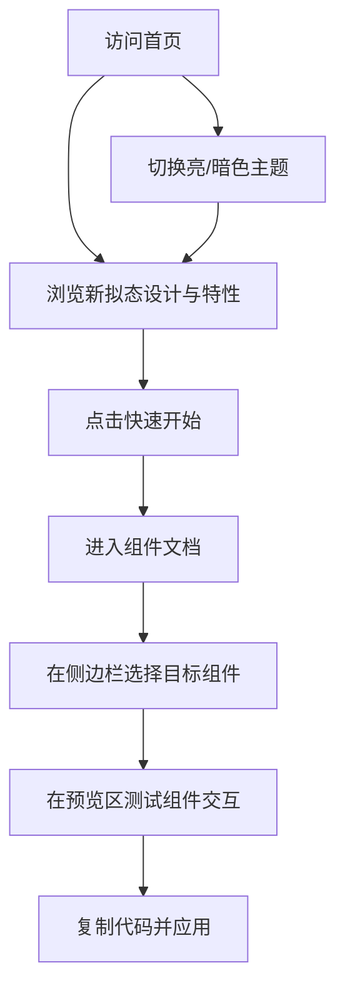

## 1. 产品概述
构建一个现代化的 Neumorphism（新拟态）UI组件库及其官方文档网站。目前市面上缺乏完整且高质量的新拟态组件库，本项目旨在为开发者提供开箱即用、高度可定制的新拟态风格组件，填补市场空白，让后续开发者能轻松地在项目中实现这种独特的美学风格。

## 2. 核心功能

### 2.1 用户角色
| 角色 | 注册方式 | 核心权限 |
|------|---------------------|------------------|
| 访客/开发者 | 无需注册 | 浏览组件库文档，查看交互预览，复制代码，切换主题。 |

### 2.2 功能模块
1. **官网首页**：展示新拟态设计美学的 Hero 区域、核心优势介绍、快速开始入口。
2. **组件文档页**：包含侧边栏导航、组件可视化预览区、代码片段展示区。
3. **主题切换系统**：支持新拟态风格的亮色（Light）和暗色（Dark）模式，确保阴影在不同背景下的完美融合。

### 2.3 页面详情
| 页面名称 | 模块名称 | 功能描述 |
|-----------|-------------|---------------------|
| 首页 | Hero区域 | 醒目的标题，展示一个复杂的新拟态组件组合（如音乐播放器面板或计算器），包含快速开始按钮。 |
| 首页 | 特性介绍 | 阐述新拟态的设计哲学和本组件库的优势（易用、响应式、暗黑模式）。 |
| 组件文档页 | 侧边栏导航 | 按类别（通用、表单、数据展示等）列出所有可用组件。 |
| 组件文档页 | 组件预览区 | 提供可交互的组件示例（按钮、输入框、卡片、开关、单选框等），展示悬浮和按下状态。 |
| 组件文档页 | 代码展示区 | 展示对应组件的使用代码，支持一键复制。 |

## 3. 核心流程
用户通过首页了解组件库风格，进入组件页面后，通过预览区体验交互，最后复制所需代码到自己的项目中使用。

## 4. 用户界面设计

### 4.1 设计风格
- **主色调**：背景与组件本身颜色必须保持一致。
  - 亮色模式：`#e0e5ec`
  - 暗色模式：`#292d32` 或 `#1a1a24`
- **点缀色**：使用柔和且明亮的颜色（如电光蓝 `#4f46e5` 或薄荷绿 `#10b981`）作为激活状态的标识。
- **阴影系统**：
  - 必须包含两个相反方向的阴影：左上角的亮色阴影和右下角的暗色阴影。
  - **Default（凸起）**：外阴影（Drop shadow）。
  - **Active/Pressed（凹陷）**：内阴影（Inner shadow）。
- **字体**：现代无衬线字体（如 Inter 或 Poppins），排版要求层级清晰。
- **圆角**：采用较大且柔和的圆角设计（如 `16px` 到 `50%`），增强“拟态”的物理质感。

### 4.2 页面设计概述
| 页面名称 | 模块名称 | UI元素 |
|-----------|-------------|-------------|
| 首页 | Hero区域 | 巨大的新拟态卡片背景，带内阴影的搜索框，凸起的 CTA 按钮，具有纵深感的排版。 |
| 组件文档页 | 整体布局 | 左侧固定导航栏（凹陷背景），右侧内容区（凸起卡片包裹代码和预览区）。 |
| 组件文档页 | 预览卡片 | 居中展示组件，提供宽敞的负空间，凸显新拟态阴影细节。 |

### 4.3 响应式
采用桌面端优先（Desktop-first）设计，向下兼容移动端自适应。优化触摸设备上的按下反馈（阴影切换），确保在手机上也能完美体验新拟态交互。
