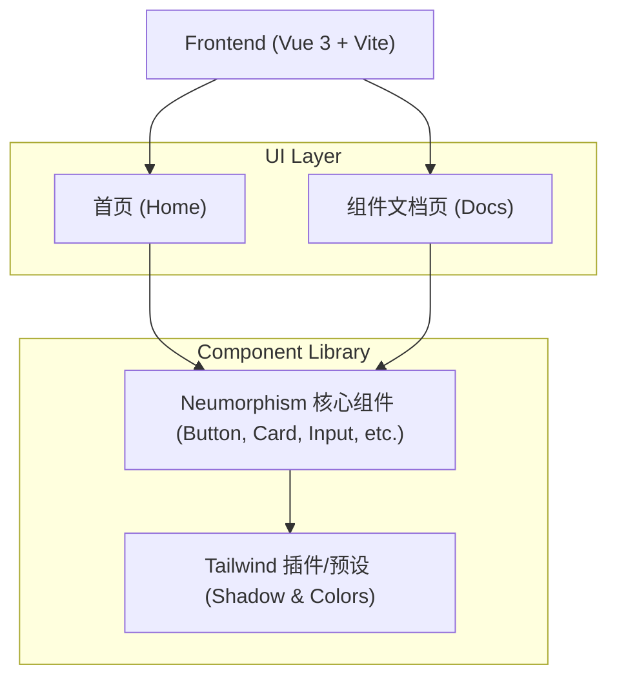

## 1. 架构设计

本项目采用纯前端架构，无需后端支持。作为 UI 组件库及文档站点，核心在于样式封装、组件隔离与文档渲染。

## 2. 技术说明
- **前端框架**: Vue 3 (Composition API + `<script setup>`)
- **构建工具**: Vite
- **样式方案**: TailwindCSS@3
  - 将通过扩展 `tailwind.config.js` 的 `boxShadow` 和 `colors` 属性，实现新拟态特有的多重阴影和内外阴影（内阴影通过 `inset` 实现）。
- **路由**: vue-router 4
- **图标库**: lucide-vue-next (线性图标，完美契合新拟态风格)
- **代码高亮**: prismjs 或 highlight.js (用于文档代码块的展示)
- **主题管理**: vueuse/core 的 `useDark` 和 `useToggle` (用于管理 Light/Dark 模式，通过动态切换 CSS 变量实现阴影和背景的无缝过渡)

## 3. 路由定义
| 路由 | 目的 |
|-------|---------|
| `/` | 官网首页，展示核心理念和 Hero 区域 |
| `/components` | 组件文档入口页（重定向至第一个组件） |
| `/components/button` | Button 按钮组件展示与代码 |
| `/components/card` | Card 卡片组件展示与代码 |
| `/components/input` | Input 输入框组件展示与代码 |
| `/components/switch` | Switch 开关组件展示与代码 |
| `/components/radio` | Radio 单选框组件展示与代码 |

## 4. API 定义
本项目为纯前端静态应用，无后端 API 交互。

## 5. 服务架构图
无。

## 6. 数据模型
无。
