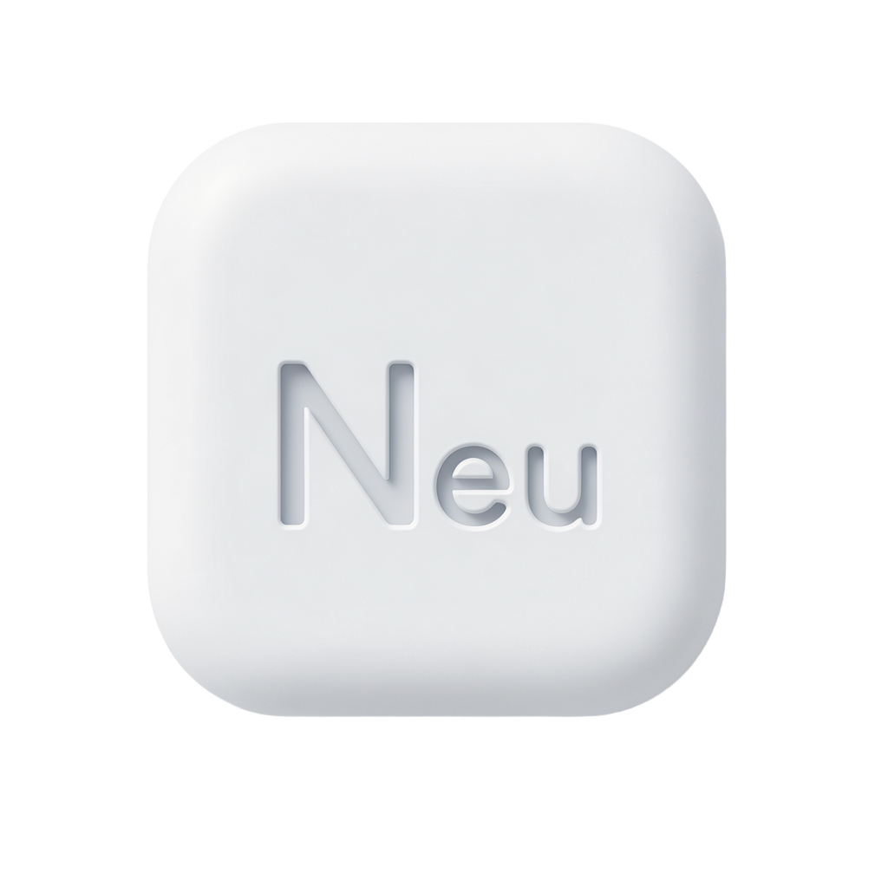
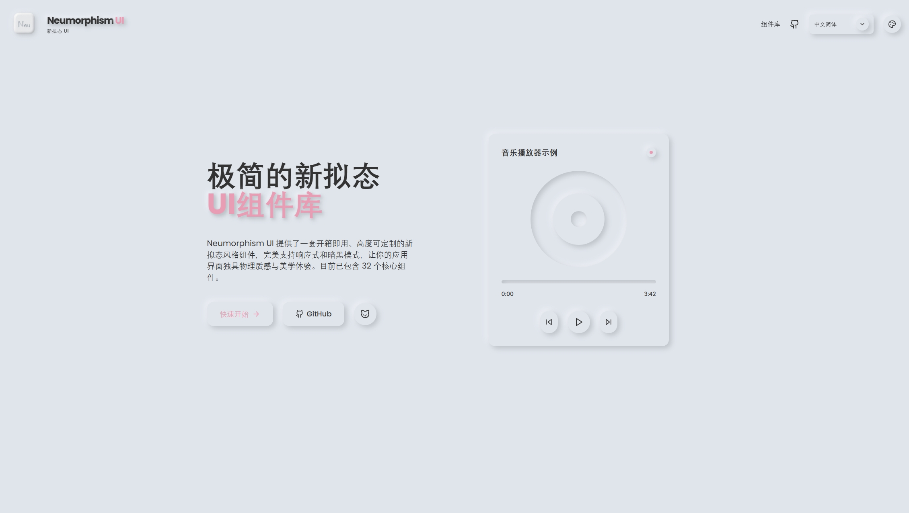
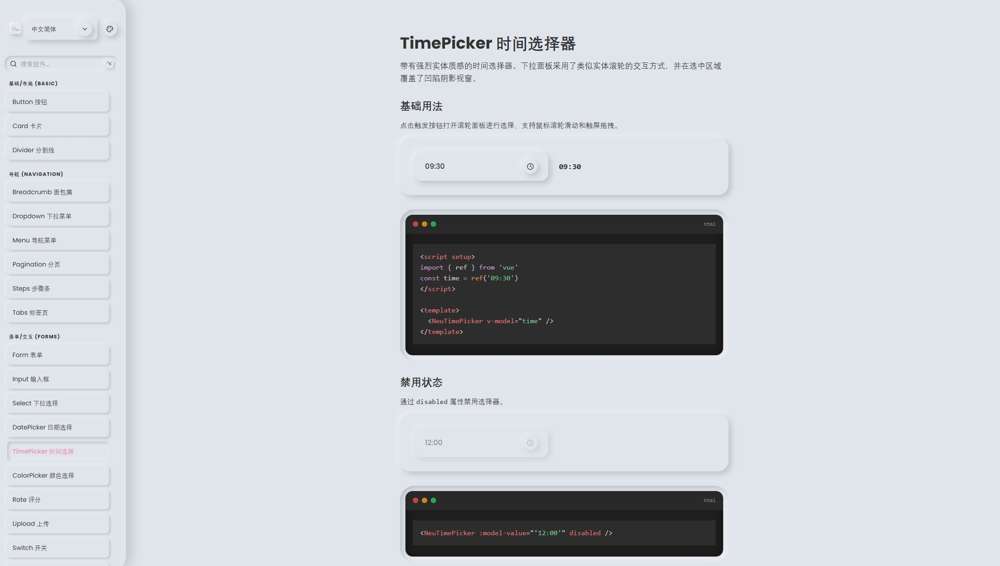

<p align="center">
  
</p>

<h1 align="center">Neumorphism UI</h1>

<p align="center">
  <strong>一套完整、高度可定制的 Neumorphism（新拟态）风格 Vue 3 组件库</strong>
</p>

<p align="center">
  <a href="#快速开始">快速开始</a> ·
  <a href="#预览">预览</a> ·
  <a href="#组件一览">组件一览</a> ·
  <a href="#主题定制">主题定制</a> ·
  <a href="#国际化">国际化</a> ·
  <a href="#贡献指南">贡献指南</a>
</p>

<p align="center">
  
  
  
  
  
</p>

---

## 预览
<details>
  <summary>首页截图</summary>
  <br />
  <p align="center">
    
  </p>
</details>
<details>
  <summary>组件截图</summary>
  <br />
  <p align="center">
    
  </p>
</details>

## 特性
- **32+ 组件** — 覆盖基础 / 导航 / 表单 / 数据展示 / 反馈浮层
- **新拟态阴影系统** — 基于 CSS 自定义属性的三层深度体系（sm/md/lg），支持凸起 / 凹陷双态
- **圆角规格系统** — 三层圆角体系（sm/md/lg），全局乘数 + 逐级微调
- **主题引擎** — 可视化配置背景色、强调色、阴影深度、圆角规格，支持预设主题
- **暗色模式** — 内置 light/dark 切换，支持跟随系统偏好
- **国际化** — 内置 `zh-CN` / `en-US`，可在首页与组件库顶部一键切换（并持久化）
- **TypeScript** — 基于 Vue 3 Composition API（`<script setup>`）的完整类型支持

## 快速开始
```bash
# 安装依赖
npm install

# 启动开发服务器
npm run dev

# 构建生产版本
npm run build

# 类型检查
npm run check

# 代码检查
npm run lint
```

## 国际化
- 语言包位于 `src/i18n/messages/`，默认支持 `zh-CN` / `en-US`
- 语言选择会写入 `localStorage` 并在刷新后保持

## 组件一览

### 基础
| 组件 | 路径 |
|------|------|
| Button | `/components/button` |
| Card | `/components/card` |
| Divider | `/components/divider` |

### 导航
| 组件 | 路径 |
|------|------|
| Breadcrumb | `/components/breadcrumb` |
| Dropdown | `/components/dropdown` |
| Menu | `/components/menu` |
| Pagination | `/components/pagination` |
| Steps | `/components/steps` |
| Tabs | `/components/tabs` |

### 表单 & 交互
| 组件 | 路径 |
|------|------|
| Input | `/components/input` |
| Select | `/components/select` |
| Switch | `/components/switch` |
| Radio | `/components/radio` |
| Checkbox | `/components/checkbox` |
| Slider | `/components/slider` |
| Rate | `/components/rate` |
| DatePicker | `/components/datepicker` |
| TimePicker | `/components/timepicker` |
| ColorPicker | `/components/colorpicker` |
| Upload | `/components/upload` |
| Form | `/components/form` |

### 数据展示
| 组件 | 路径 |
|------|------|
| Table | `/components/table` |
| Avatar | `/components/avatar` |
| Badge | `/components/badge` |
| Tag | `/components/tag` |
| Progress | `/components/progress` |
| Accordion | `/components/accordion` |
| Carousel | `/components/carousel` |
| Tree | `/components/tree` |
| Skeleton | `/components/skeleton` |
| Scrollbar | `/components/scrollbar` |
| Empty | `/components/empty` |

### 反馈 & 浮层
| 组件 | 路径 |
|------|------|
| Modal | `/components/modal` |
| Drawer | `/components/drawer` |
| Toast | `/components/toast` |
| Tooltip | `/components/tooltip` |
| Popconfirm | `/components/popconfirm` |
| Alert | `/components/alert` |
| Spin | `/components/spin` |

## 主题定制
主题通过 CSS 自定义属性实现，所有组件颜色引用以下变量：

```css
:root {
  --bg-color: #e0e5ec;
  --text-color: #333333;
  --shadow-light: #ffffff;
  --shadow-dark: #a3b1c6;
  --accent: #4f46e5;

  --neu-scale: 1;
  --neu-radius-scale: 1;
  --neu-radius-sm: calc(8px * var(--neu-radius-scale));
  --neu-radius-md: calc(16px * var(--neu-radius-scale));
  --neu-radius-lg: calc(24px * var(--neu-radius-scale));
}
```

点击文档站右上角调色板图标可打开主题配置器，支持预设主题与参数实时调整，并可一键复制 CSS 变量。

## 技术栈
- **框架**：Vue 3（Composition API + `<script setup>`）
- **语言**：TypeScript
- **构建**：Vite 5
- **样式**：Tailwind CSS 3 + CSS 自定义属性
- **路由**：Vue Router 4
- **图标**：Lucide Vue Next

## 贡献指南
- 欢迎提交 Issue / PR
- 新组件建议保持与现有 neu 组件目录风格一致：`src/components/neu/`

## License
MIT
